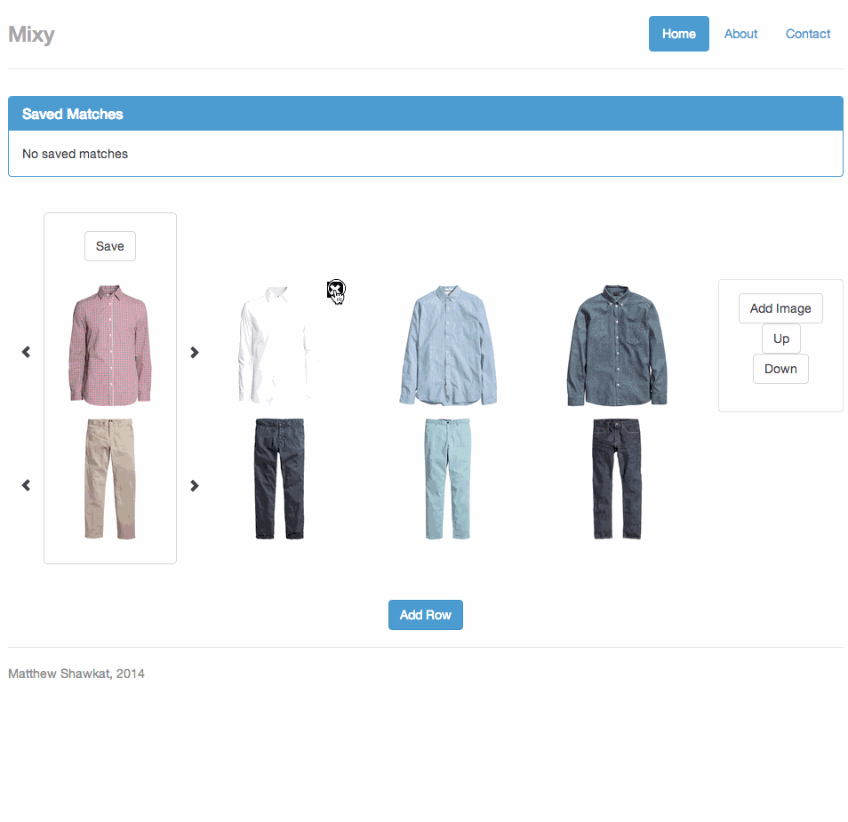

Mixy-client
===========

An AngularJS app that provides the ability to mix and match pictures using multiple interactive carousels

Implementation
--------------
An AngularJS directive was created to represent a row that can navigate through a series of images. The images are an array of urls passed to the directive as an attribute. The directive is 2-way bound to the directive, so if images are deleted or the order is changed, then the model is updated automatically. New images can be added too.

Rows are represented as a 2d array of urls. Each array represents a row. Rows can be added, deleted and reordered.

A collection can be formed by saving the first column. The idea is to mix and match images to find potential matches.

Ideas
-----
Have a submit button that saves the current state of the mixy to a server, and provide a url for future access (server is implemented, just needs connecting the client to it)

At first, a mixy will be public, so it can be edited by others. A user can create an account and set the mixy as private (similar to JSFiddle)

Demo
----

